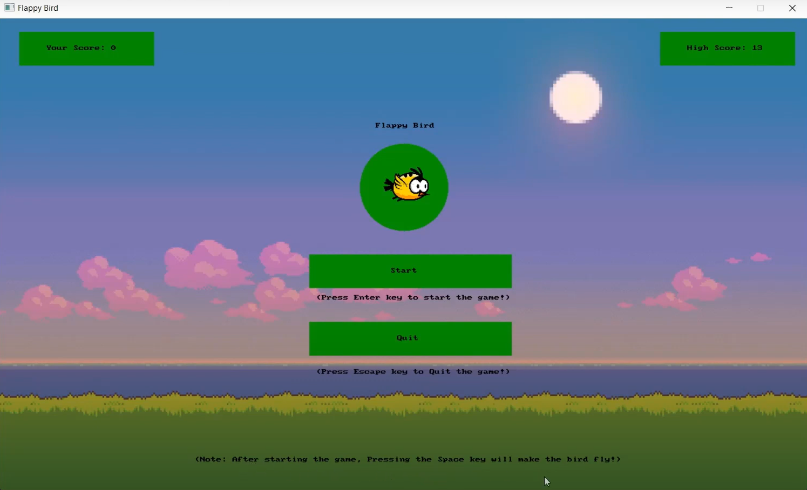
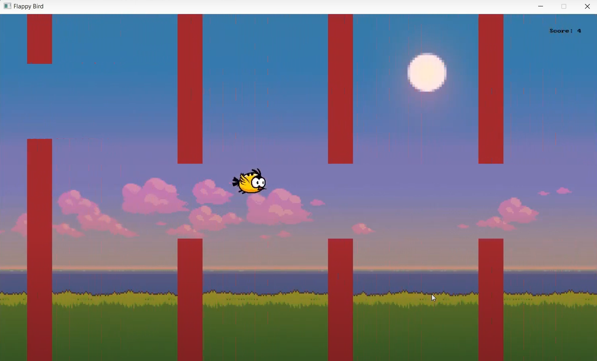

# 🐦 Flappy Bird Game (C#)

Welcome to the **Flappy Bird Game**, a fun and interactive recreation of the classic arcade game, built using **C#** and **SplashKitSDK**. This project showcases fundamental game development concepts such as collision detection, event handling, and score management.

## 🎮 About the Game

The objective of the game is to keep the bird flying by avoiding obstacles (walls) and collecting points as you progress. It incorporates elements like a start screen, a game loop, collision handling, and score tracking.

---

## 🌟 Features

- **Game Mechanics:**
  - Tap the `Spacebar` to make the bird fly and avoid the walls.
  - Start the game by pressing `Enter` and quit anytime using `Escape`.
  
- **Dynamic Difficulty:**
  - Randomized wall heights ensure variability in gameplay.

- **Score Tracking:**
  - Maintains the current score and displays the highest score from previous games.

- **Engaging Graphics:**
  - Custom background, bird, and wall graphics for an immersive experience.

- **Home Page:**
  - Displays instructions, current score, and high score.

---

## 🛠️ Tech Stack

- **Programming Language:** C#
- **Framework:** [SplashKitSDK](https://splashkit.io/) (for graphics, event handling, and game logic)

---

## 🚀 How to Run the Game
**1.** Clone this repository to your local machine.\
**2.** Locate the **"Game"** folder.\
**3.** Run the **FlappyBirdGame.exe** and enjoy!

---

## 📸 Screenshots

## Gameplay
Click below to watch the video!

---

## 🚧 Future Enhancements

- Add different game levels with increased difficulty.
- Introduce new bird designs and power-ups.
- Create a leaderboard system for high scores.

---

## 🤝 Acknowledgments

This project was built using **SplashKitSDK**, a powerful library for game development in C#. A big thanks to the creators of SplashKitSDK for their excellent documentation and tools.

---

## 📬 Contact

Feel free to explore the project and share your feedback. For any queries or suggestions, reach out to me at [sathiyanarayanan.s1698@gmail.com](mailto:sathiyanarayanan.s1698@gmail.com).

